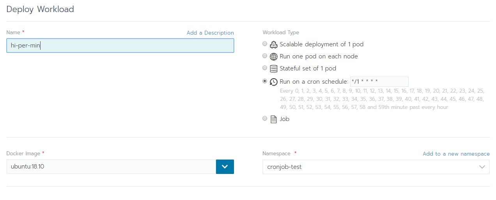
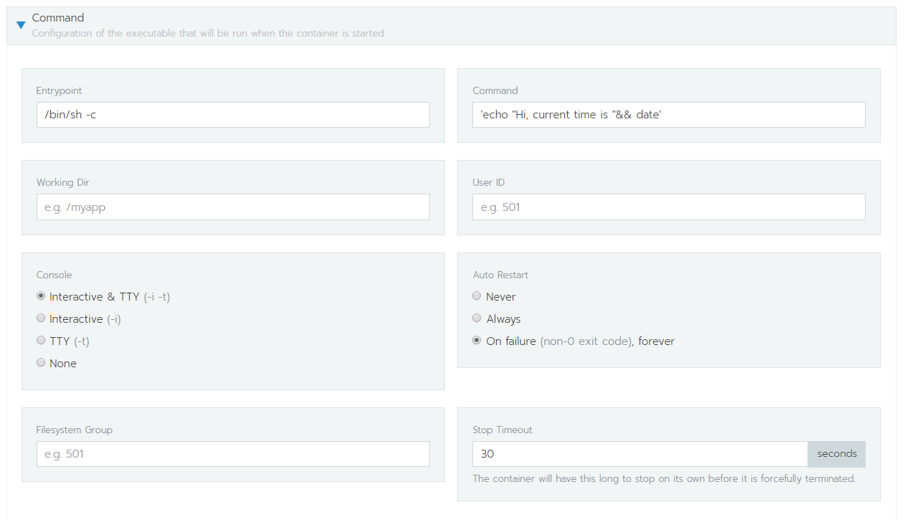
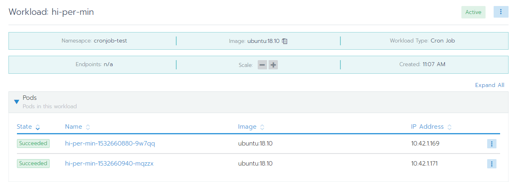

# Cron Job 排程

step 1.  
開一個 deployment，Workload Type 選 `Run on a cron schedule`，設定排程時間  

設定執行指令，Auto Restart 設為 `Never` or `On faliure`
```bash
# sample command
echo "Hi, current time is " && date
```  

step 2.  
完成了之後，等排程時間到，就會顯示 succeeded，預設顯示 10 筆執行紀錄

