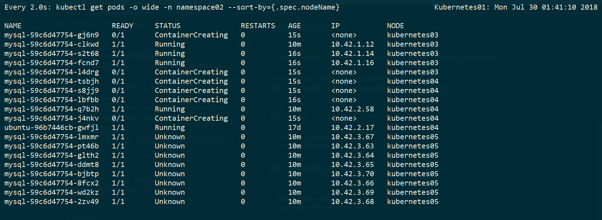

# Disruption (服務中斷測試)
- [設定縮短 node NotReady 時間](#設定縮短-node-NotReady-時間)
- [正常 node 關閉程序](#正常-node-關閉程序)
- [master/node 的 shutdown/crash 測試](#master/node-的-shutdown/crash-測試)
- [mysql shutdown/crash 測試](#mysql-shutdown/crash-測試)


## 設定縮短 node NotReady 時間
- 預設 5 分鐘  
[node shutdown timeout shorter](
https://stackoverflow.com/questions/47317682/kubernetes-node-shutdown-crash-recovery)  
[rancher config.yml](
https://gist.github.com/superseb/a9925c465b42bc5001b94c4ec241265a)
---
<!-- PodDisruptionBudget -->
## 正常 node 關閉程序
### 原始狀態
```bash
kubectl get nodes
NAME           STATUS    ROLES               AGE       VERSION
kubernetes02   Ready     controlplane,etcd   21d       v1.10.3
kubernetes03   Ready     worker              21d       v1.10.3
kubernetes04   Ready     worker              21d       v1.10.3
kubernetes05   Ready     worker              21d       v1.10.3
```

1. ### 停止讓新pod分配到node上
    1.  下 cordon 指令停止讓新 pod 分配到 node 上  
`kubectl cordon kubernetes05`
    2.  或是 Rancher-> Nodes 找到要停止的 node，右邊3個點選cordon


    - kubernetes05 節點的狀態改為 `SchedulingDisabled`
    ```bash
    kubectl get nodes
    NAME           STATUS                     ROLES               AGE       VERSION
    kubernetes02   Ready                      controlplane,etcd   21d       v1.10.3
    kubernetes03   Ready                      worker              21d       v1.10.3
    kubernetes04   Ready                      worker              21d       v1.10.3
    kubernetes05   Ready,SchedulingDisabled   worker              21d       v1.10.3
    ```

2. ### 遷移 pod 到其他 node 上
    - drain 指令，會自動遷移該 node 上的 pod (Rancher沒有提供UI)
    ```bash
    kubectl drain kubernetes05 --delete-local-data --ignore-daemonsets
    ```
    >`--delete-local-data` 影響的只會是 emptyDir volumes  
    The only thing that --delete-local-data affects is emptyDir volumes  
    https://github.com/kontena/pharos-host-upgrades/issues/26

3. ### 更新 docker
    ```bash
    apt-cache madison docker-ce
    apt-get upgrade docker-ce
    ```

4. ### 開放分配 pod 到 node 上
    - uncordon指令，重新分配 daemonsets, 新的 pod 到 node 上
    ```bash
    # 開放分配pod到node上
    kubectl uncordon kubernetes05
    ```


---
## master/node 的 shutdown/crash 測試
### 情境一： node 被 shutdown
node 狀態顯示為 NotReady

- pod 變成 unknow 狀態，重啟 pod 在其他 node 
- unknow 狀態會自己 terminating  



### 情境二： 開新 deployment 時 node 被 shutdown 
- 在 shutdown node 上: 
    - 已經啟動的 pod: 所有 pod (running or creating) 變成 unknow 狀態，重啟在其他 node，遷移到其他 node
    - 未啟動的 pod: unknow 狀態，直接開啟於其他 node

- 在 healthy node 上: 
    - 已經啟動的 pod: 不動
    - 未啟動的 pod: 正常開啟  


### 情境三： 更新 deployment 時 node 被 shutdown
- 在 shutdown node 上: 
    - 已經更新 pod: unknow 狀態，遷移到其他 node，最後 terminating
    - 未更新的 pod: unknow 狀態，最後 terminating

- 在 healthy node 上: 
    - 已經更新 pod: 不動
    - 未更新的 pod: 正常更新

### 情境四： 刪除 deployment 時 node 被 shutdown
- 在 shutdown node 上: 所有 pod 變成 unknow 狀態，最後 terminating

### 情境五： master crash
- 功能停擺，重啟後會需要一段時間逐步恢復正常運作

---
## mysql shutdown\/crash 測試
- mysql insert into 時 pod 被刪除
    - 新資料不會被寫入，維持寫入前狀態  
    `ERROR 2013 (HY000) at line 1: Lost connection to MySQL server during query`

- mysql insert into 時 node shutdown
    - 新資料不會被寫入，維持寫入前狀態

