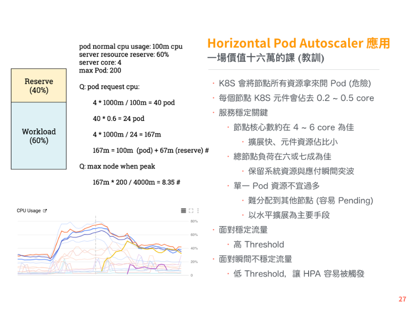

## 修改 node 的 --max-pods 限制

- kubernetes 預設一個 node 最大可開 110 個 pod  
也可以自己指定大小  
https://prefetch.net/blog/2018/02/10/the-kubernetes-110-pod-limit-per-node/
https://kubernetes.io/docs/reference/command-line-tools-reference/kubelet/
```yaml
# cluster.yaml
...
...
services:
  kubelet: 
    extra_args: 
      max-pods: "200"
```

## 節點負荷
- 節點工作量約六或七成, 其餘保留以應付突波
- 每個節點的 k8s 元件，佔約 0.2 ~ 0.5 core


https://tachingchen.com/tw/blog/kubernetes-101/


## 快速部屬
- Ansible
https://docs.ansible.com/ansible/2.6/modules/vmware_guest_module.html
