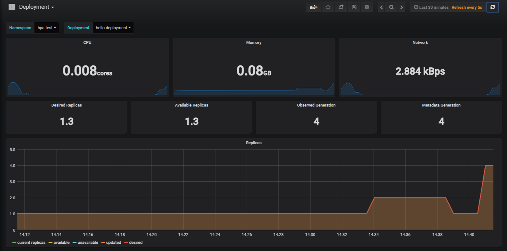

# Horizontal Pod Autoscaler 自動擴充

Rancher 目前尚無法從UI設定
### 建立步驟
1. 建立一個 Deployment  
  - `spec.replicas`  
  預設一份 replicas  
  - `resources.requests.cpu`  
  當 Kubernetes 在運行該 Pod 時，需要配置 20m CPU 給該 Pod  
  ( 200milicpu(milicore)，代表要求一個 CPU 0.2 core )
```yaml
# hello-deployment.yaml
apiVersion: apps/v1beta2
kind: Deployment
metadata:
  name: hello-deployment
spec:
  replicas: 1
  selector:
    matchLabels:
      app: hello-pod
  template:
    metadata:
      labels:
        app: hello-pod
    spec:
      containers:
      - name: my-pod
        image: zxcvbnius/docker-demo:latest
        ports:
        - containerPort: 3000
        resources:
          requests:
            cpu: 20m
```

2. 建立一個 HorizontalPodAutoscaler  
  - `spec.scaleTargetRef.apiVersion`,  
  `spec.scaleTargetRef.kind`,  
  `spec.scaleTargetRef.name`  
    指向剛剛建立的 Depployment  
  - `spec.maxReplicas`  
  最大可以 5 份 replicas  
  - `targetCPUUtilizationPercentage`  
  當該 hello-pod CPU 使用率達到 10m (20m*50%) 時，HorizontalPodAutoscaler 就會幫我們新產生一個 Pod
```yaml
# hello-hpa.yaml
apiVersion: autoscaling/v1
kind: HorizontalPodAutoscaler
metadata:
  name: hello-hpa
spec:
  scaleTargetRef:
    apiVersion: apps/v1beta2
    kind: Deployment
    name: hello-deployment
  minReplicas: 1
  maxReplicas: 5
  targetCPUUtilizationPercentage: 50
```
3. 等一段時間，確定 hpa 可以抓到 Deployment 的使用量  
(如圖上面為失敗，下面為成功，若是等太久可以看metrics-server的log除錯)
```
kubectl get hpa -n hpa-test
NAME             REFERENCE                          TARGETS         MINPODS   MAXPODS   REPLICAS   AGE
hello-hpa        Deployment/hello-deployment        <unknown>/50%   1         5         0          24s
helloworld-hpa   Deployment/helloworld-deployment   0%/50%          1         5         1          5d
```
-----
### 測試
1. 建立一個 hello-deployment 的 ingress
2. 持續向它做 query
```bash
while true; do curl http://xxxxxxx.xip.io; done
```
3. 過一段時間 deployment 的資源使用量就會上升  
- 透過 kubectl get hpa 查看情形
```
kubectl get hpa -n hpa-test
NAME             REFERENCE                          TARGETS    MINPODS   MAXPODS   REPLICAS   AGE
hello-hpa        Deployment/hello-deployment        230%/50%   1         5         4          4m
helloworld-hpa   Deployment/helloworld-deployment   0%/50%     1         5         1          5d
```  
- 也可以透過 grafana 監控  


