# Rancher
### 必要設定
- Name:    
  Deployment 名稱  
  <!-- `metadata.name` -->
- Image  
  Docker Image 
  <!-- `spec.template.spec.containers[].image` -->
- Namespace  
  指定 Deployment 所屬的 Namespace
  <!-- ``   -->
- Port Mapping  
  對外服務使用的 port
  
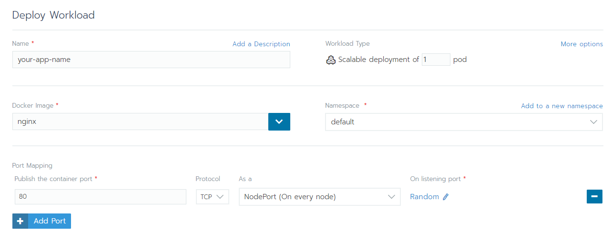

---
### 環境變數設定
- 直接設定變數
- 從 ConfigMap 或 Secret 設定
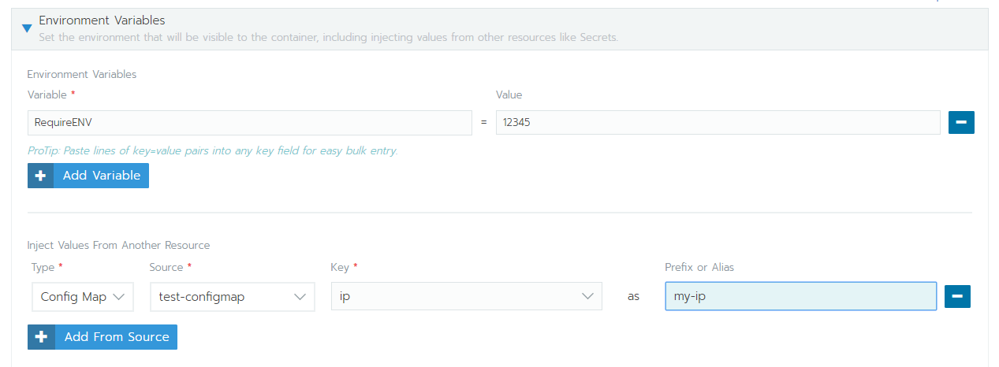

---
### 指定節點
- none
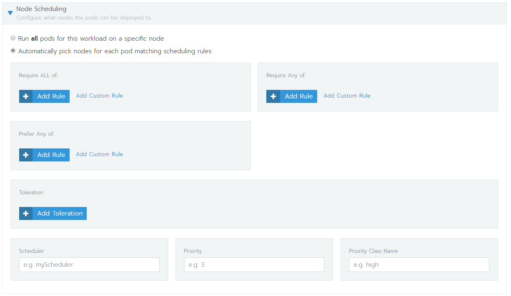
### 檢測 Pod 是否正常執行 
- TCP
- HTTP, HTTPS
- Command
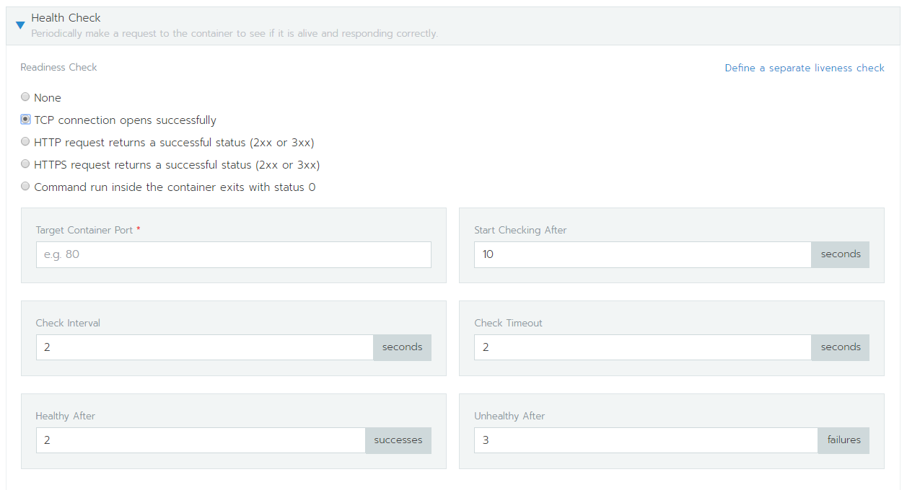
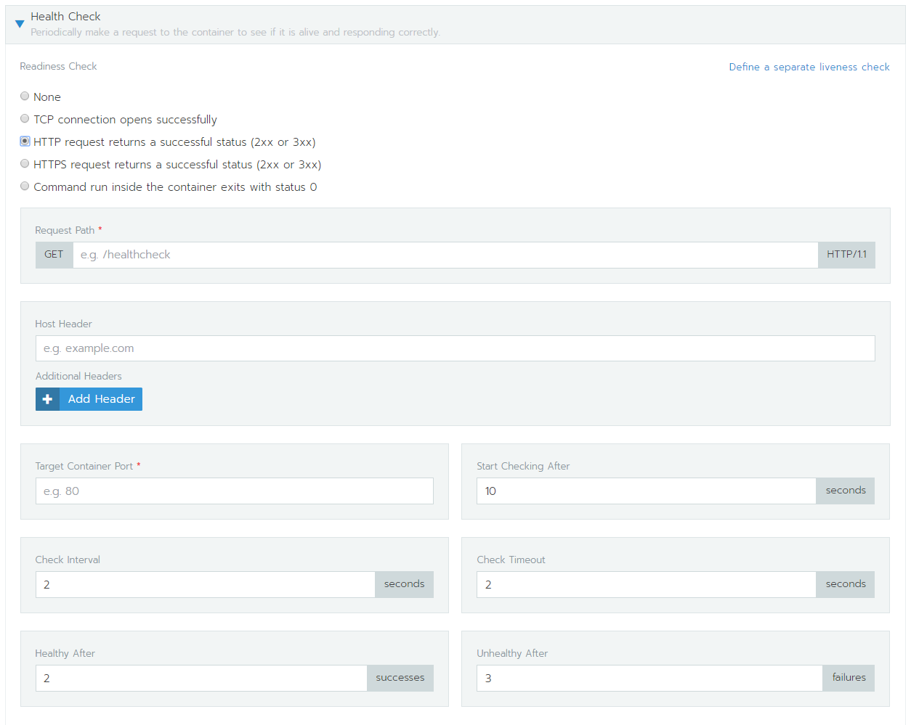

---
### Pod 啟動規則  
當 pod 更新重啟 或是 Scaling up 的時候，設定一次最多可以開啟的 pod 數量，最少幾個 Pod 可用
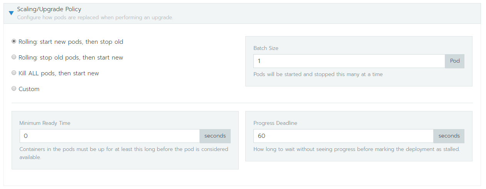

---
### 啟動後執行 Command
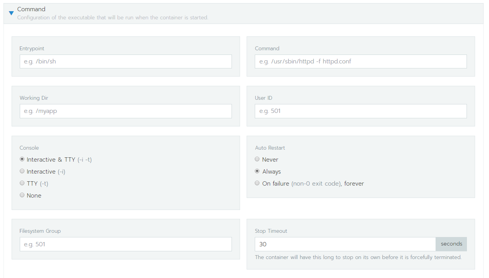

---
### Network
- none
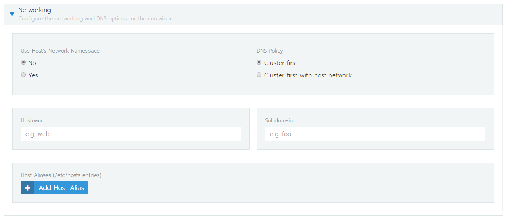

---
### Lable & Annotations
- Label 配合 services, HPA
- Annotations 給人看的標記
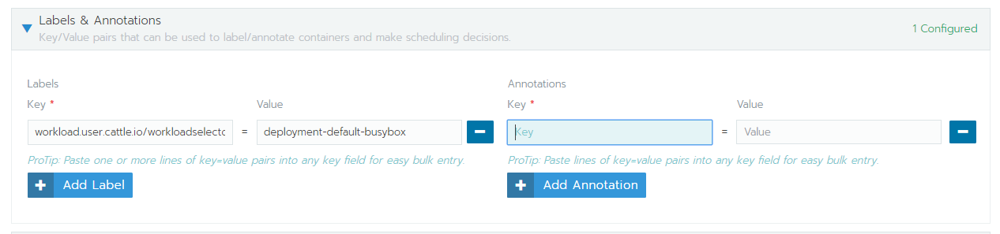

---
### 安全設定 & 資源限制
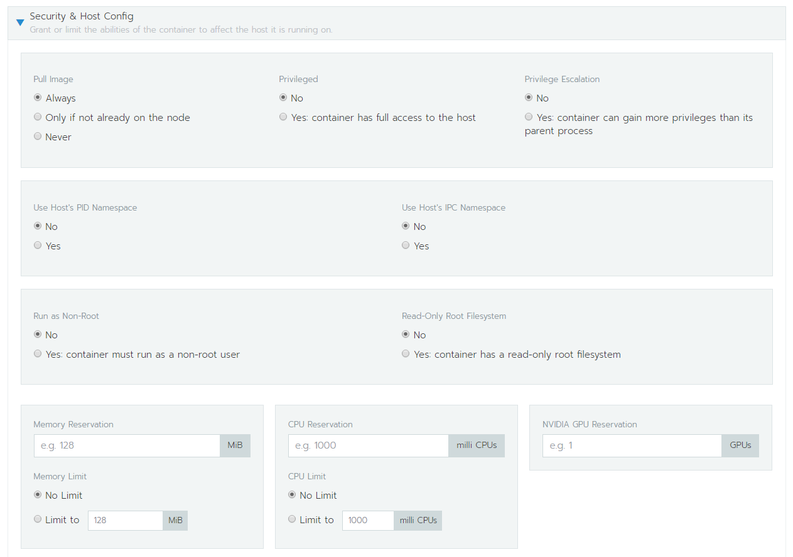
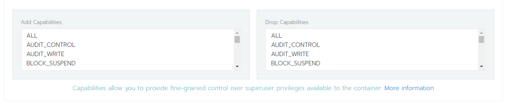

---
