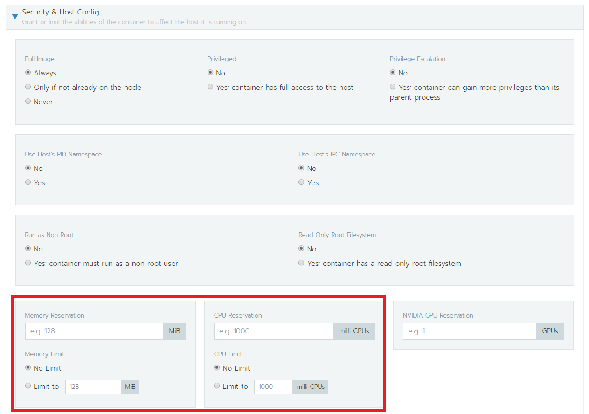

# Resource limit
### 資源種類
- CPU
- Memory

### 基本單位
- 1 個 cpu (Hyperthread)
    - 100m(millicpu) = 0.1 unit of cpu
- 1 bytes
    - 500 Mi
    - 10 Gi

### 限制型態
以 container 為單位作限制
- spec.containers[].resources.limits.cpu 
- spec.containers[].resources.limits.memory 
- spec.containers[].resources.requests.cpu
- spec.containers[].resources.requests.memory  
**limits: 限制最高, requests: 保證最低** 
    #### 規則
    0 <= `request` <= Node Allocatable  
    `request` <= `limit` <= Infinity

### YAML example
```yaml
apiVersion: apps/v1
kind: Deployment
metadata:
  name: resource-limits-deploy
  label: 
   app: wp-resource-limits
spec:
  replicas: 1
  selector: 
    matchLabels:
      app: wp-app
  template:
    metadata:
      labels:
        app: wp-app
    spec:
      containers:
      - name: db
        image: mysql
        env:
        - name: MYSQL_ROOT_PASSWORD
          value: "password"
        resources:
          requests:
            cpu: 200m
            memory: 200Mi
          limits:
            cpu: 400m
            memory: 400Mi
      - name: wp
        image: wordpress
        resources:
          limits:
            cpu: 300m
            memory: 400Mi
```
### Rancher 設定
- Edit-> Advance Option-> Security & Host Congig  


