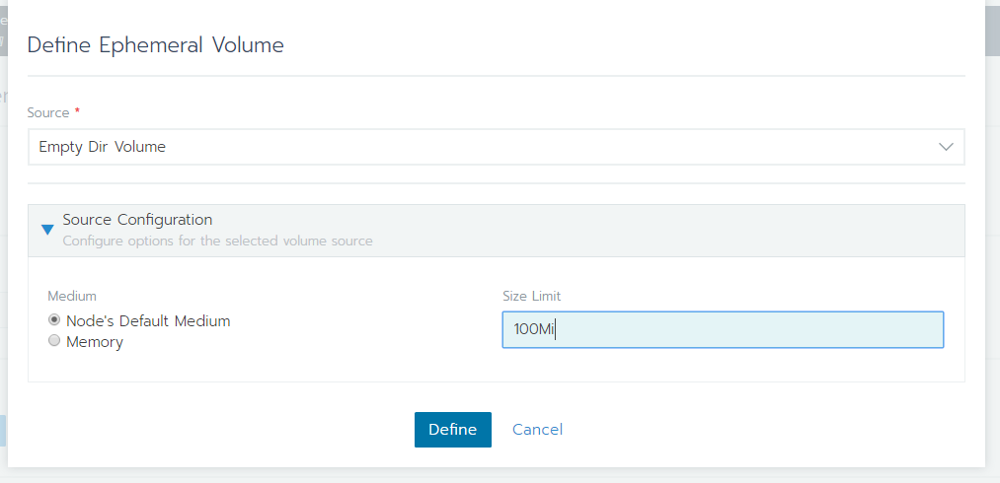
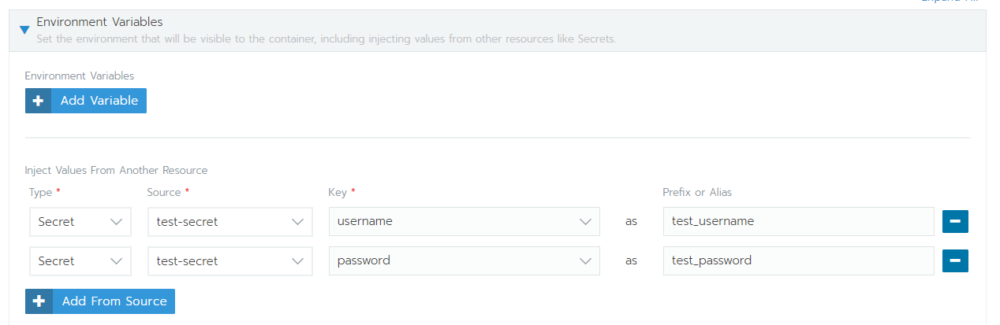
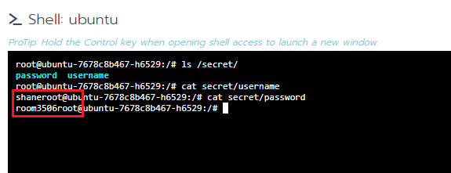

# volume 使用
- [EmptyDir](#EmptyDir)
- [configmap](#ConfigMap)
- [Secret](#Secret)
- [persistent volume](#persistent-volume)
    - [設定 nfs 當 persistent volume](#設定-nfs-當-persistent-volume)
    - [掛載 nfs 當 persistent volume](#掛載-nfs-當-persistent-volume)

## EmptyDir
暫時的儲存空間，同一個 Pod 內的 container 都可以存取，但資料會在 Pod 被刪除時消失
1. 到 Deployment 新增 volume (Add volume-> Use a Empa)，選 Empty Dir Volume，設定大小

2. 設定 mountPath


---
## ConfigMap  
configmap 是用來儲存設定檔案的 volume，例如 nginx 的設定檔
1. 到 Peoject-> Resources，新增一個 ConfigMap (按 Add Secret)
2. 設定 Value

3. 到 Deployment 新增 volume (Add volume-> Use a configmap)，設定 permission, mountPath

4. 在 mountPath 下可以找到 secret file  


---
## Secret
secret 是用來儲存機密資料，像是 ip, mysql_passowrd....  
- 可以用 volume 用掛載檔案的方式，把 secret 存成檔案傳入
- 用 enviroment variable，傳入  
1. 到 Peoject-> Resources，新增一個 Secret (按 Add Secret)

2. 設定 Value

3. 用檔案傳入：  
到 Deployment 新增 volume (Add volume-> Use a secret) 

or 用環境變數傳入：  
到 Deployment 新增 ENV (Add From Source)

4. 在 mountPath 下可以找到 secret file  

or  
ENV 可以找到設定的 secret  

---

## persistent volume
- [Rancher 關於 persistent volume 的介紹](https://rancher.com/docs/rancher/v2.x/en/concepts/volumes-and-storage/)
### 設定 nfs 當 persistent volume  
1. 部署 nfs-driver  
> .yaml file 可以複製到 Rancher 上 Import YAML 的地方貼上

[kubernetes-incubator/external-storage](https://github.com/kubernetes-incubator/external-storage/tree/master/nfs-client)  
- RBAC
        1. `deploy/auth/serviceaccount.yaml`
        2. `deploy/auth/clusterrole.yaml`
        3. `deploy/auth/clusterrolebinding.yaml`  
        (指定要部署在哪個 `namespace`，修改clusterrolebinding.yaml的 `namespace`)
- 部署Provisioner
        1. `deploy/deployment.yaml`  
        (修改其中的：`PROVISIONER_NAME`、`NFS_SERVER`、`NFS_PATH`，NFS的位置等資料，**有四處需要修改**)  
#### 範例:
```yaml
# deploy/deployment.yaml
# 掛載到 172.16.100.37 的 nfs server 上
# 的 /zfsPool/nfs_share 目錄
# **注意有四處需要修改**
...
...
...
spec:
    serviceAccountName: nfs-client-provisioner
    containers:
    - name: nfs-client-provisioner
        image: quay.io/external_storage/nfs-client-provisioner:latest
        volumeMounts:
        - name: nfs-client-root
            mountPath: /persistentvolumes
        env:
        - name: PROVISIONER_NAME
            value: provisioner-nfs 
        - name: NFS_SERVER
            value: 172.16.100.37  # **此處需要修改**
        - name: NFS_PATH
            value: /zfsPool/nfs_share  # **此處需要修改**
    volumes:
    - name: nfs-client-root
        nfs:
        server: 172.16.100.37  # **此處需要修改**
        path: /zfsPool/nfs_share  # **此處需要修改**
```

2. 設定 StorageClass  
Rancher-> Cluster-> Storage-> Storage Classes

點選 Add Class

設定資料  
    - Provisioner 填寫為剛才`deploy/deployment.yaml`中設定的 `PROVISIONER_NAME` 的值 (這裡是 provisioner-nfs)  
    - `Reclaim Policy` 可以選擇
        - Delete   
        代表當綁定的 Pod 消失後，該 Volume 相對應得資源也會自動移除
        - Retain  
        則是指即便 Pod 消失後，Volume 相對應的物件資源並不會跟著消失
    

3. 完成後，可以設定預設使用的 Storage Class


### 掛載 nfs 當 persistent volume 
    hint: 
    - pv = persistent volume  
    - pvc = persistent volume claim
    - sc = Storage Class  

- 兩種掛載方式  
    1. [建立 Deployment 同時以 pvc 新增一個 pv](#第1種方式---建立-Deployment-同時以-pvc-新增一個-pv)
    2. [建立 Deployment 時，指定已經存在的 pv](#第2種方式---建立-Deployment-時，指定已經存在的-pv)
#### 第1種方式 - 建立 Deployment 同時以 pvc 新增一個 pv  
1. 找到 volumes 欄位選 `Add a new persistent volume`


2. 設定儲存空間位置 (Storage Class) 空間大小

3. 設定 mountPath

4. 到 Project 下的 volumes 可以看到剛建立的 pv 就完成了

#### 第2種方式 - 建立 Deployment 時，指定已經存在的 pv  
1. 新增 pv

2. 設定儲存空間位置 (Storage Class) 空間大小

3. 完成後可以看到剛建立的 pv
4. 再到 deployment 裡面，找到 volumes 欄位選 `use an existing persistent volume`，設定 mountPath，就完成了


