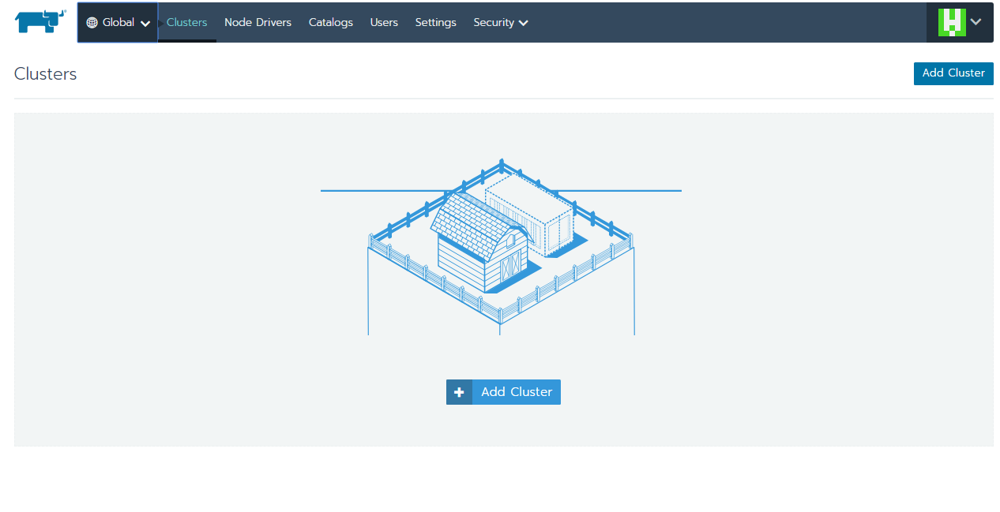
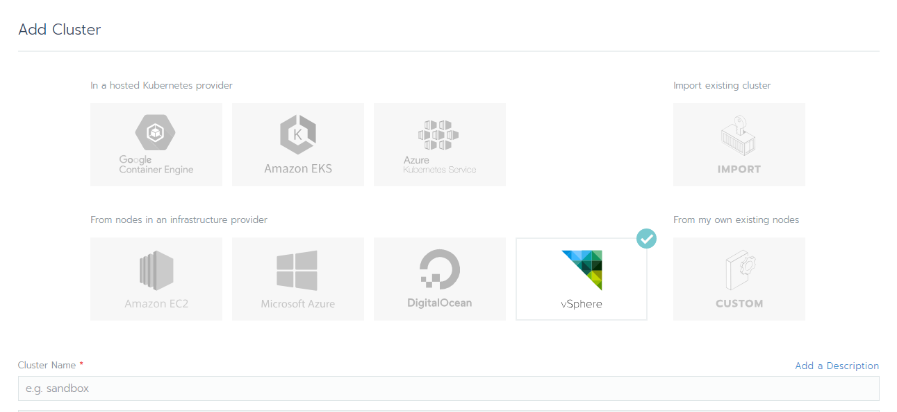
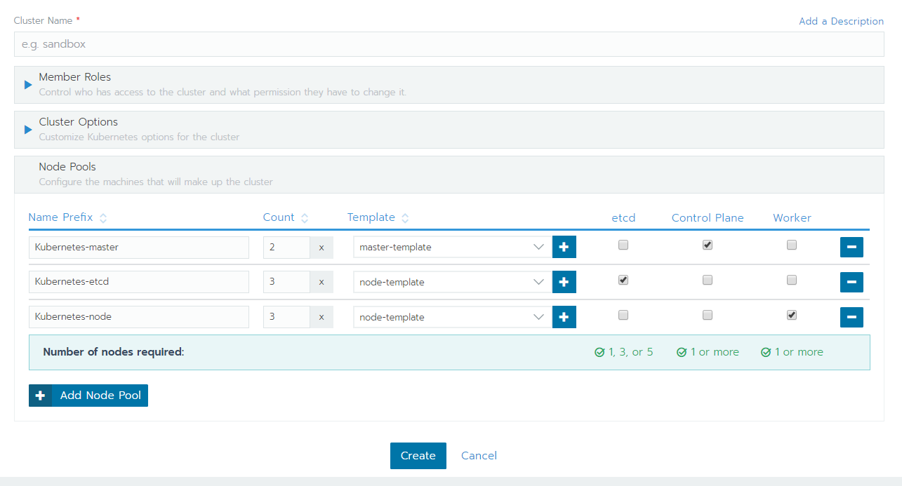
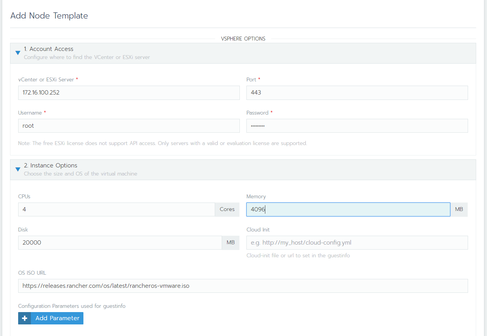
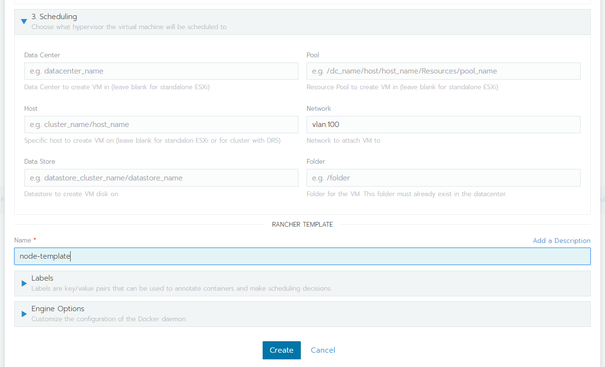
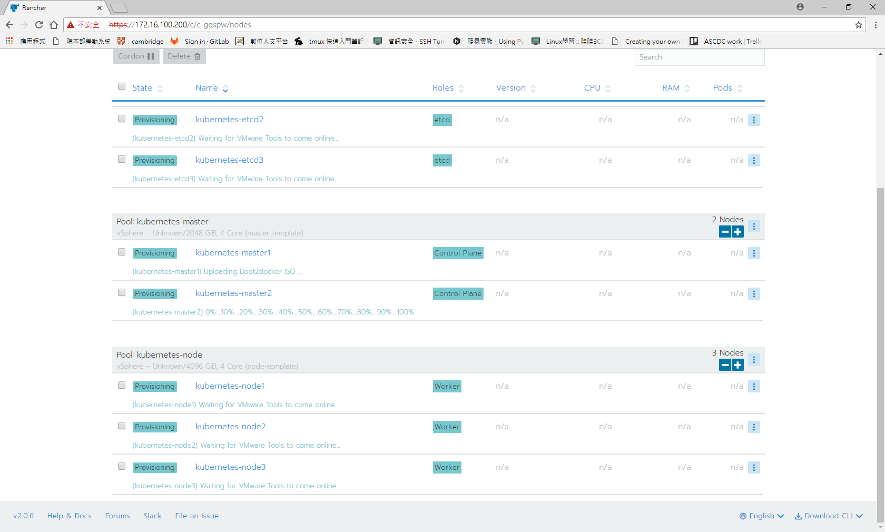
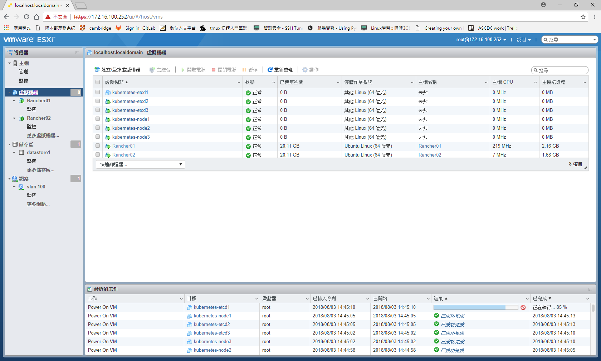
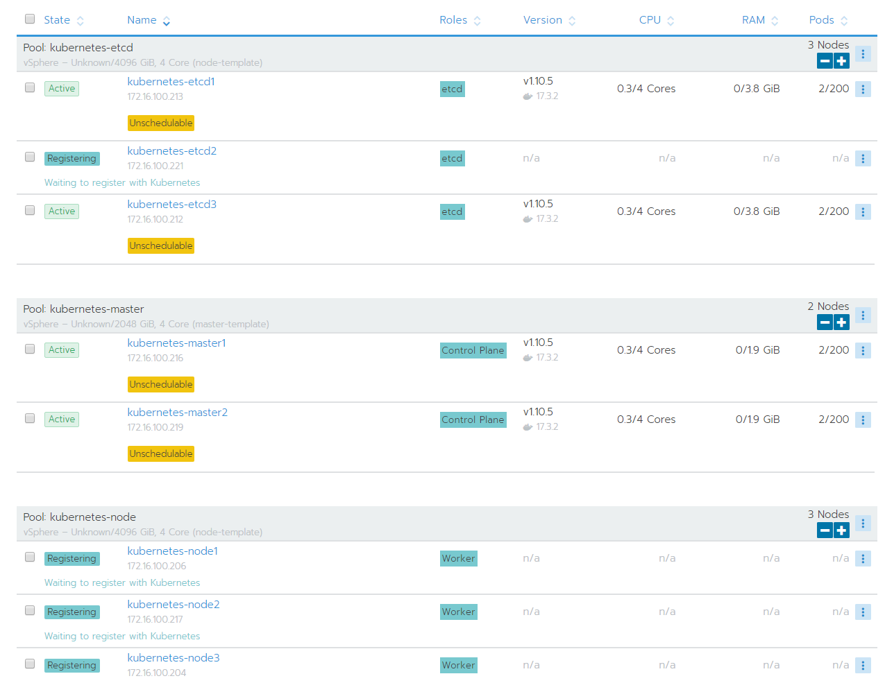
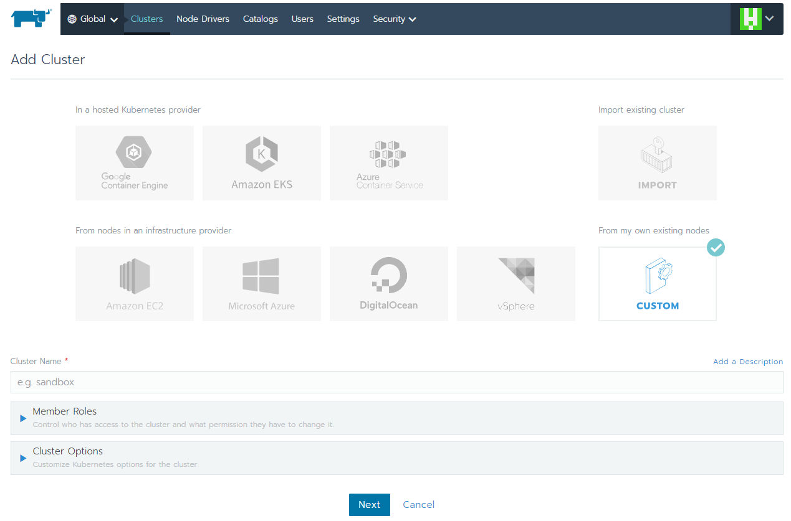
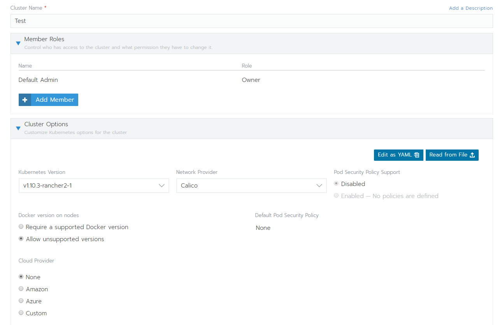

# 用 Rancher 在 ESXi 上快速部署 Kubernetes
## 1. 安裝 Rancher
https://rancher.com/docs/rancher/v2.x/en/quick-start-guide/deployment/quickstart-manual-setup/
```
docker run -d --restart=unless-stopped \
  -p 80:80 -p 443:443 \
  rancher/rancher:latest
```

## 2. 快速部署相關設定
### vSphere 設定
- 權限設定
https://rancher.com/docs/rancher/v2.x/en/cluster-provisioning/rke-clusters/node-pools/vsphere/  
- (或是直接用 root 帳號)
### Rancher 設定



Template 設定 (ESXi Server 位置, ESXi 使用者, VM 規格, 網路介面)


等待一段時間，若是遇到錯誤它會自己重新設定。
當下方訊息出現 `Waiting to register with Kubernetes` 就是安裝完成了，等到所有 VM 都完成，會開始啟動 Cluster


master 和 etcd 會先啟動，最後才是 node

## 3. 完成
---


`Waiting to register with Kubernetes`



