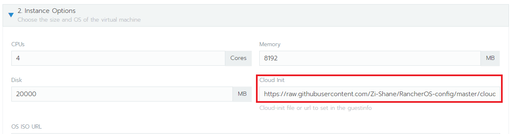
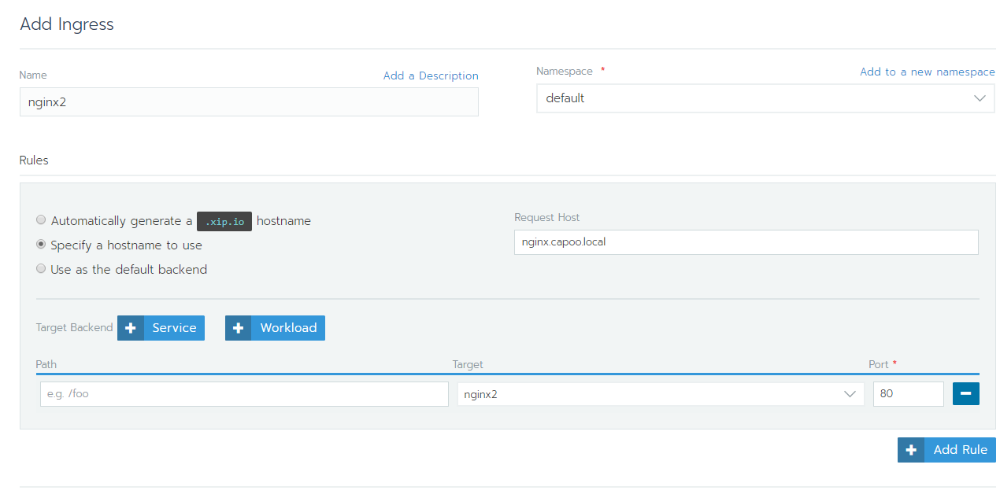
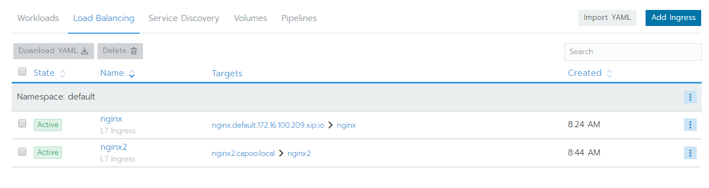
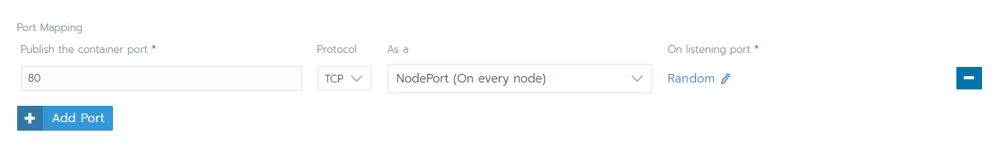
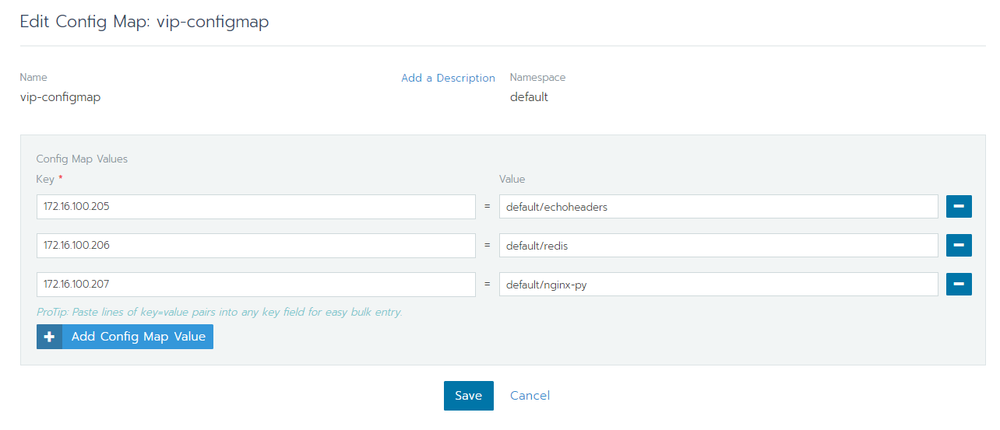

# 對外服務

- [部署固定 ip 的 VM](#部署固定-ip-的-VM)
- [Ingress](#Ingress)
- [NodePort](#NodePort)
  - [HTTP](#http)
  - [TCP/UDP](#tcpudp)
- [Loadbalance](#Loadbalance)
- [virtual ip](#virtual-ip)

---
## 部署固定 ip 的 VM
可以在Cloud Init中指定，但一個template只能設定一個ip  

https://github.com/Zi-Shane/RancherOS-config/blob/master/cloud-config.yml

---
## Ingress
將 service 設定對外 doamin name
### HTTP
1. 建立 Ingress
  - 可以用預設的 domain，也可以自己自訂(需要 DNS Server)
  - 選要對應的 workload 和 port

2. 完成

### TCP/UDP
1. 建立 Ingress
  - 可以用預設的 domain，也可以自己自訂
  - 選要對應的 workload 和 port

2. 修改 ingress-nginx namespace 底下的 configmap
- tcp-services
- udp-services
``` yaml
apiVersion: v1
kind: ConfigMap
metadata:
  name: tcp-services
  namespace: ingress-nginx
data:
  9000: "default/redis:6379" # 設定在這
  # <對外Port>: "<namespace>/<service-name>:<service-port>"
```
3. 完成，就可以用 ingress 設定的 domain name 連進去   

ref:  
http://blog.rascal.com.tw/nginx-ingress-tcp/


---
## NodePort
所有節點都會開啟某個 port 對外
1. 在建立 deployment 的時候指定
- container 上的 80 對上一個隨機的 port (30000 以上)


---
## Loadbalance
自架的 k8s 無法使用


---

## 其他
## virtual ip
可以自己指定一組 ip 對應到某個 workload  
要先按照 github 文件部署....
https://github.com/kubernetes/contrib/tree/master/keepalived-vip  


### 設定

直接修改 vip-configmap 作設定  
- 格式：\<ip> = \<namespace>/\<workload>  
e.g. 172.16.100.205 對應到 default 底下的 nginx  
設定長這樣 `172.16.100.205 = default/nginx`

