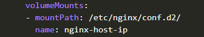
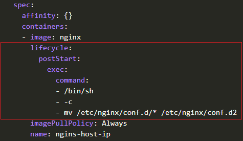
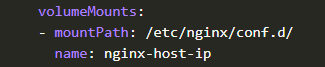
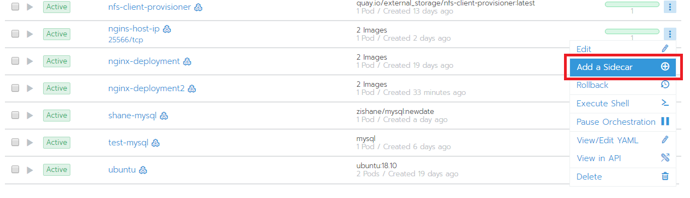
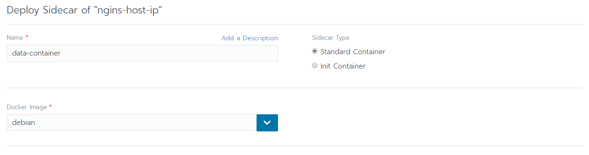
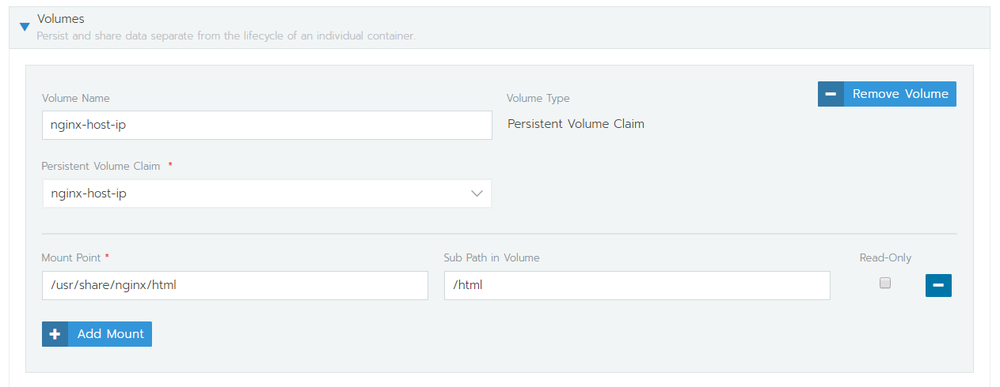
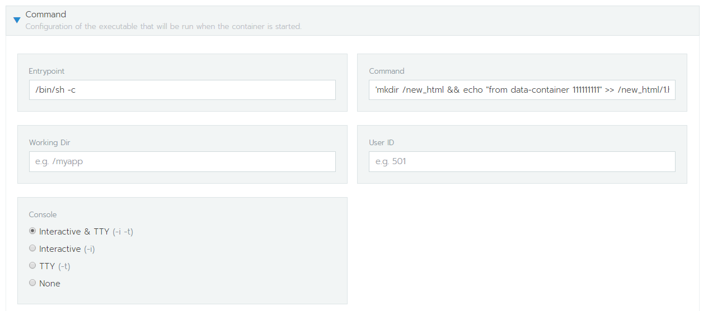
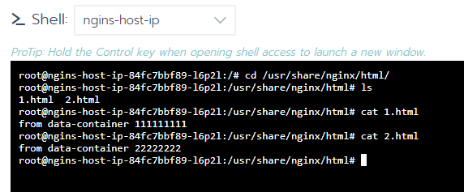

# mount volume 資料覆蓋原有資料問題
## 以 nginx 為範例

### 解決方法 1
將資料複製一分到 persistent volume
>step 1.  
先設定一個 volume 掛到位置不衝突的 mountPath，這裡用`conf.d2`  
  
step 2.   
設定指令在 Pod 啟動後執行，把要保留的資料複製到mountPath   
(這裡只能用修改 yaml file 的方式設定)  
  
step 3.  
最後把 mountPath 指定回要掛載的位置並**把第2步設定的部分刪掉**  


---
### 解決方法 2
用 sidecar 功能，在 pod 中開2個 container，一個是要主要的 container，一個是含有資料的 container。  
將他們共同掛載一個 volume，並設定有資料的 container 啟動時執行 cp 指令複製到 volume 裡面

以 nginx 複製 /usr/share/nginx/html 為範例    
step 1.  
開一個 nginx 的 deployment，並掛上 volume  
step 2.  
找到剛建立的 deployment，選 Add a Sidecar  

step 3.   
這裡建立一個裝有資料的 container，設定好名字mountPath, 複製資料的command(複製資料到 mountpath)    
**這裡用一個 debian 的 container 作 sample，當作儲存資料的container**  
  
  
設定 command 時要注意，最後要跑不會停止的指令，否則 pod 會不斷被停止重啟，造成錯誤  
```bash
# sample command
mkdir /new_html && 
echo "from data-container 111111111" >> /new_html/1.html && 
echo "from data-container 22222222" >> /new_html/2.html && 
cp /new_html/* /html-data && 
sleep infinity 
```
  
step 4.   
完成了之後，到 nginx 掛載的 volume 下面，就會看到 data-container 裡要的資料了   
   

---


```yaml
# sample.yaml
apiVersion: apps/v1
kind: Deployment
metadata:
  name: nginx-deployment2
  labels:
    app: nginx
spec:
  restartPolicy: Never
  replicas: 1
  selector:
    matchLabels:
      app: nginx
  template:
    metadata:
      labels:
        app: nginx
    spec:
      containers:
      - name: nginx-container
        image: nginx
        volumeMounts:
        - name: html-vol
          mountPath: /usr/share/nginx/html
        ports:
        - containerPort: 80
      - name: debian-container
        image: debian
        volumeMounts:
        - name: html-vol
          mountPath: /html-vol
        command: ["/bin/sh", "-c"]
        args:
        - mkdir /html &&
          echo "from debian-container" >> /html/index.html &&
          cp /html/index.html /html-vol &&
          while true; do
            date >> /index.html;
            sleep 1;
          done

      volumes:
      - name: html-vol
        emptyDir: {}
```
